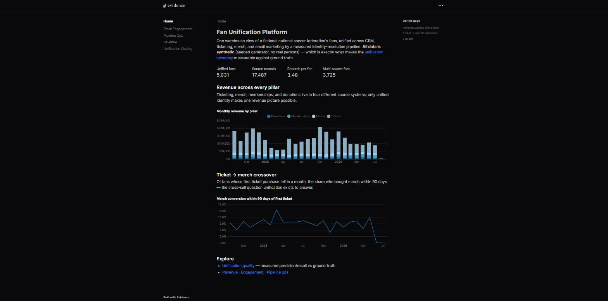
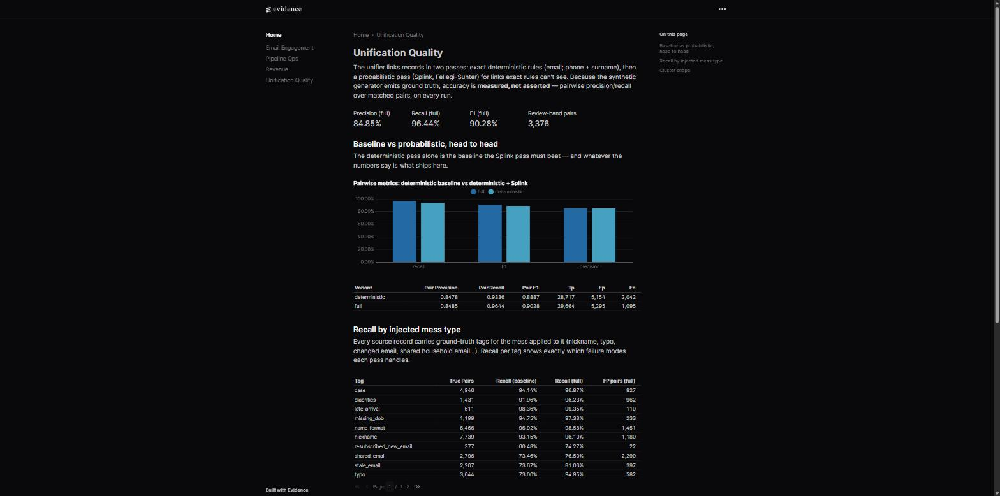

# fan-unification-platform

**A fan identity-resolution and data-warehouse platform, with the accuracy
measured instead of asserted.** Four messy source systems for a fictional
national soccer federation — a Salesforce-style CRM, ticketing, merch, and
email marketing — flow through Prefect-orchestrated pipelines into an
S3-style lake and a Postgres star-schema warehouse, where a deterministic +
probabilistic (Splink) unifier resolves ~17,500 records into ~5,000 golden
fan records. The synthetic generator emits ground truth, so every CI run
scores the linkage: precision/recall overall and per failure mode, baseline
vs probabilistic, head to head.

**Live dashboards:** https://nick-bellows.github.io/fan-unification-platform/
— built in CI from a real pipeline run, never hand-fed.

[](https://nick-bellows.github.io/fan-unification-platform/)
[](https://nick-bellows.github.io/fan-unification-platform/unification)

> **All data is synthetic** (seeded generator, no real persons; emails end in
> `example.com`). No LLM is used anywhere in the runtime path — the
> probabilistic matcher is classical Fellegi-Sunter statistics.

## The honest headline

Full-scale run (5,000 true entities, 17,487 records → **5,031 unified
fans**), pairwise metrics against ground truth:

| variant | precision | recall | F1 |
| --- | --- | --- | --- |
| deterministic rules only | 0.848 | 0.934 | 0.889 |
| + Splink at the naive threshold (0.90) | 0.778 | 0.998 | **0.874 — worse than the baseline** |
| + Splink at the measured operating point (0.9999) | 0.849 | **0.964** | **0.903** |

The first probabilistic operating point *lost* to the plain-rules baseline on
F1 at scale — most false positives (households sharing an email, name+zip
coincidences) score above 0.999 because Fellegi-Sunter posteriors saturate.
Instead of quietly retuning, the repo commits the full
[threshold sweep](eval/results/threshold_sweep.md) that shows the curve and
selects the operating point from it — recall +3.1 pts and F1 +1.4 pts over
the baseline at equal precision, with 3,376 uncertain pairs routed to
clerical review rather than merged. Full report:
[`eval/results/`](eval/results/) · per-mess-type breakdown on the
[dashboard](https://nick-bellows.github.io/fan-unification-platform/unification).

## Architecture

```
 synthetic source systems              lake (MinIO/S3 API)         warehouse (Postgres 16)
┌──────────────────────────┐          ┌──────────────────┐        ┌─────────────────────────────┐
│ mock Salesforce REST API │─extract─▶│ raw/<source>/    │─COPY──▶│ raw → staging → identity →  │
│ ticketing JSONL drops    │ (Prefect │   dt=.../batch.* │        │ core (star) → marts         │
│ merch CSV exports        │  flows)  └──────────────────┘        │ + ops (audit/dq)            │
│ email-marketing events   │                                      └──────────────┬──────────────┘
└──────────────────────────┘   Splink unification (DuckDB engine) ◀── parquet ────┤
                               xref + golden dim_fan written back ────────────────┤
                                                                                  ▼
                                                    Evidence.dev site → GitHub Pages
```

What each layer demonstrates:

- **Extract/Load** — watermark-incremental Salesforce extraction over the
  real protocol shape (OAuth, SOQL, `nextRecordsUrl`); genuine `boto3`
  against an S3 API; COPY loads that are replay-safe by construction
  (delete+insert keyed on source file, sha registry, an integration test that
  proves a re-run is a no-op); pandera contracts quarantining bad rows with
  reasons; survived schema drift (the merch export renames a column
  mid-history, deliberately).
- **Warehouse** — a hand-built transform runner (ordered SQL models, audited
  row counts — [why not dbt](docs/decisions/0003-plain-sql-runner-over-dbt.md));
  star schema with a hybrid SCD2 fan dimension; one incremental fact, on
  purpose; SQL data-quality gates whose error severity fails CI — and which
  are themselves tested by breaking an invariant and watching them fail.
- **Unification** — union-find over exact rules, then Splink 4 on DuckDB
  (EM-trained, seeded); auto-merge / clerical-review / non-match bands;
  stable fan_ids so SCD2 history means something
  ([ADR 0005](docs/decisions/0005-identity-interface-and-scd2.md)); a
  ground-truth eval harness the pipeline itself can never read.
- **Ops** — Prefect retries/backoff; a nightly scheduled end-to-end run with
  artifacts; run/load/model/check audit trail in the `ops` schema, surfaced
  on the [ops dashboard](https://nick-bellows.github.io/fan-unification-platform/ops);
  column-level grants keeping PII from the analyst role (tested).
- **AWS story at $0** — Postgres stands in for Redshift and MinIO for S3
  ([ADR 0002](docs/decisions/0002-postgres-as-redshift.md));
  [Terraform for the real deployment](infra/terraform/) validates in CI;
  [`docs/redshift-migration.md`](docs/redshift-migration.md) covers every
  dialect divergence that matters.

## Quickstart

```sh
git clone https://github.com/nick-bellows/fan-unification-platform
cd fan-unification-platform
docker compose up -d --build --wait   # postgres, minio, prefect, mock salesforce
python -m venv .venv && . .venv/bin/activate   # Windows: .venv\Scripts\Activate.ps1
pip install -e .

fanuni generate            # synthetic sources + ground truth (~15 MB)
fanuni init-db             # schemas, ops tables, grants
fanuni pipeline            # ingest -> transform -> unify -> quality gates
fanuni evaluate            # score linkage against ground truth
```

Prefect UI at `http://localhost:4200`, MinIO console at `:9001`. Dashboards
locally: `cd site && npm install && npm run sources && npm run dev`.

## CI

| Job | Proves |
| --- | --- |
| `lint` / `typecheck` / `test` | ruff, mypy, 48 unit tests |
| `integration` | 16 ordered stages against real services: full load reconciliation, re-run no-op, drift handling, quarantine, a gate that fails when data breaks, linkage-eval floors, PII grants |
| `docker` / `gitleaks` / `terraform` | images build, no secrets in history, IaC validates |
| `site` | Evidence dashboards build from a real pipeline run; deploys to Pages on `main` |
| `nightly-pipeline` (scheduled) | operating the pipeline: nightly end-to-end run with retained artifacts |

## Documentation

[How it was built](docs/how-it-was-built.md) (including the bugs the
integration suite caught) · [Runbook](docs/runbook.md) ·
[Data dictionary](docs/data-dictionary.md) ·
[Redshift migration](docs/redshift-migration.md) ·
[Interview brief](docs/interview-brief.md) ·
[ADRs](docs/decisions/) · [Future work](docs/future-work.md)

## License

MIT
